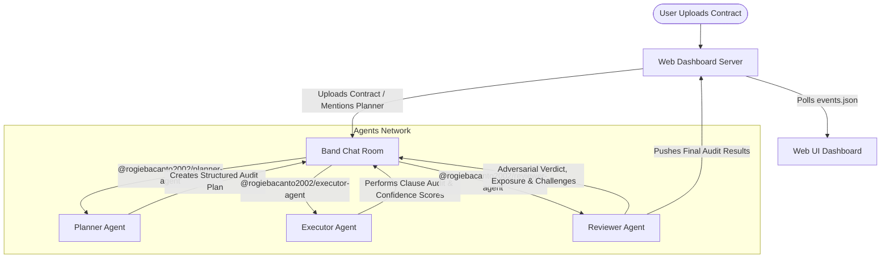

# ⚖️ LexAudit: Multi-Agent Compliance Audit System

LexAudit is a multi-agent system designed for automated, high-fidelity contract compliance auditing. Built on the **Band** multi-agent coordination platform, it coordinates three specialized agents (Planner, Executor, and Reviewer) to parse contracts, construct compliance checklists, execute detailed clause analysis, and perform adversarial review.

A beautiful, interactive web dashboard provides real-time visualization of the agent communication, dynamic audit logs, contract visual highlighting, and historical audits.

* **Architecture:** Multi-Agent Coordination via Band Platform
* **Deployment Mode:** Standalone Python Backend & Web Dashboard (scripts/combined_server.py)

---

## 🏆 Hackathon Updates & Core Enhancements

During this hackathon, we implemented several major feature updates, resolved key developer experience blockers, and robustly optimized the multi-agent pipeline:

### 1. 📂 Automatic Standard Framework Reference Rules
* **The Problem:** Previously, users selected a compliance framework (like GDPR or CCPA/CPRA) but had to manually search for, download, and upload the official guideline documents to audit against them, which was tedious and token-inefficient.
* **The Solution:** We integrated preloaded reference rules directly in the frontend dashboard. When selecting chips (GDPR, CCPA/CPRA, HIPAA, SOC 2, SOX, AML/KYC), the frontend automatically compiles and appends these guidelines under the `REFERENCE RULES:` header of the message payload.
* **Comprehensively Latest:** Curated rules include recent 2025/2026 updates such as the **EU-US Data Privacy Framework (DPF)** for GDPR transfers, CPRA opt-out requirements, SOC 2 supply chain policies, and SEC cybersecurity disclosure rules for SOX.

### 2. 🎯 Exact Fallback Verdict Parsing (Major Fix)
* **The Problem:** When an audit completed with a high risk score (e.g. 85/100) and an overall status of `fail`, the dashboard incorrectly displayed a status of `APPROVED`. The fallback parser defaulted to `"APPROVED"` and only matched `"REJECTED"` if the exact word was present in the LLM text content.
* **The Solution:** Fixed the self-healing parser in `src/agent_factory.py` to correctly map `overall_status == "fail"` to `REJECTED` and `overall_status == "pass_with_findings"` to `APPROVED_WITH_CONDITIONS`.

### 3. 🔍 Resolved Contract Truncation
* **The Problem:** The context limits in the agent listeners were restricted to 3,000 characters per message. Typical contracts were cut off mid-text, forcing the Executor agent to bounce audits back with "missing context" errors.
* **The Solution:** Increased `MAX_CONTEXT_CHARS` to `80,000` and `MAX_SINGLE_MSG_CHARS` to `50,000`, enabling complete line-by-line analyses of large documents.

### 4. 🔗 Fixed `cannot_mention_self` API Error
* **The Problem:** Fallback messaging failed with 422 API errors because handle comparisons in self-mention filtering didn't account for variations in leading `@` symbols.
* **The Solution:** Normalized all handles via `.lstrip("@").lower()` before filtering, ensuring clean messages that do not trigger API self-mention validation errors.

---

## 🌟 Unique Features

### ⚔️ Devil's Advocate Mode
Instead of blindly agreeing with findings, the **Reviewer** agent critiques findings from the opposing party's perspective. It highlights potential legal loopholes, challenges severity levels, and presents contrarian arguments. In the UI, challenged items are marked with an orange border and a swords icon (⚔️).

### 📊 Confidence Heatmap
Both the **Executor** (analyzing compliance checkpoints) and the **Reviewer** (critiquing findings) assign confidence scores (0–100%) to their output. The UI maps these to a color-coded bar (Green for High, Amber for Medium, Red for Low) to immediately highlight where human oversight is most needed.

### 💰 Dollar Exposure Estimation
For every High or Critical risk finding, the agents estimate the potential financial impact (dollar exposure) of the non-compliance. These per-finding ranges are aggregated into a total risk banner at the top of the dashboard.

---

## 🏗️ Multi-Agent Architecture



1. **Planner Agent:** Creates an audit blueprint (structured compliance checkpoints) based on the contract type and context.
2. **Executor Agent:** Iterates through every checkpoint, matches them against the contract text, generates findings, and assigns confidence scores.
3. **Reviewer Agent:** Performs adversarial critique (Devil's Advocate), estimates dollar exposure, and assigns the final compliance verdict.

---

## 🔌 LLM Providers & Model Routing

LexAudit integrates both **Featherless AI** and **AI/ML API** to demonstrate a robust, multi-provider model routing strategy that prevents model-specific cognitive biases.

To prevent demo failure due to credit/balance limitations (e.g., when the AI/ML API $10 hackathon credit is fully exhausted), **LexAudit defaults all agents to run on Featherless AI** out-of-the-box (using the active Featherless credits). However, the codebase is fully equipped with cross-provider model routing:

*   **Default Configuration (Featherless AI):**
    *   **Endpoint:** `https://api.featherless.ai/v1`
    *   **Agents Powered:** **Planner**, **Executor**, and **Reviewer** (active in the live demo).
    *   **Model:** `Qwen/Qwen2.5-32B-Instruct`
*   **Optional Toggle (AI/ML API for Reviewer):**
    *   **Endpoint:** `https://api.aimlapi.com/v1`
    *   **Agent Powered:** **Reviewer Agent** (using `meta-llama/Llama-3.3-70B-Instruct-Turbo`).
    *   **How to Activate:** Set `USE_AIMLAPI=true` in your `.env` file to route the Reviewer agent to AI/ML API. This enables true multi-provider and multi-model routing across separate API networks.

---

## 🛠️ Installation & Setup

### Prerequisites
- Python 3.10+
- Node.js (for local testing)
- A registered account on [app.band.ai](https://app.band.ai) and [Featherless.ai](https://featherless.ai)

### 1. Clone & Install Dependencies
```bash
git clone https://github.com/DeathKnell837/band-of-agents-hackathon.git
cd band-of-agents-hackathon

# Initialize virtual environment
python -m venv .venv
.venv\Scripts\activate

# Install Python requirements
pip install -r requirements.txt
```

### 2. Configure Environment Variables
Create a `.env` file in the root directory:
```env
THENVOI_REST_URL=https://app.band.ai
THENVOI_WS_URL=wss://app.band.ai/ws
FEATHERLESS_API_KEY=your_featherless_api_key
```

Configure `agent_config.yaml` with your Band agent credentials (Planner, Executor, Reviewer UUIDs and API keys):
```yaml
agents:
  planner_agent:
    id: "your-planner-agent-uuid"
    key: "your-planner-agent-api-key"
    handle: "@rogiebacanto2002/planner-agent"
  executor_agent:
    id: "your-executor-agent-uuid"
    key: "your-executor-agent-api-key"
    handle: "@rogiebacanto2002/executor-agent"
  reviewer_agent:
    id: "your-reviewer-agent-uuid"
    key: "your-reviewer-agent-api-key"
    handle: "@rogiebacanto2002/reviewer-agent"
```

---

## 🚀 How to Run & Verify

### 1. Run Automated Integration Tests
We created and committed integration test scripts to verify the compliance audit pipeline locally or against the Render backend:

* **Verify Custom Rules Upload:**
  ```bash
  python scripts/test_rules_audit.py
  ```
* **Verify Standard Framework Guidelines (Auto-bundled GDPR & CCPA/CPRA):**
  ```bash
  python scripts/test_standard_framework_rules.py
  ```

### 2. Start the Local Web Server
Starts the frontend dashboard server on port 3000 (with CORS-enabled REST API proxy):
```bash
python scripts/server.py
```

### 3. Start the Agent Listener Network
Launches all 3 agents in parallel, establishing WebSocket connections to the Band platform to process incoming audits:
```bash
python scripts/run_all.py
```

### 4. Open the Dashboard
Open your browser and navigate to `http://localhost:3000`. Upload `sample_contract.txt`, click **Start Audit**, and watch the agents collaborate in real-time!
